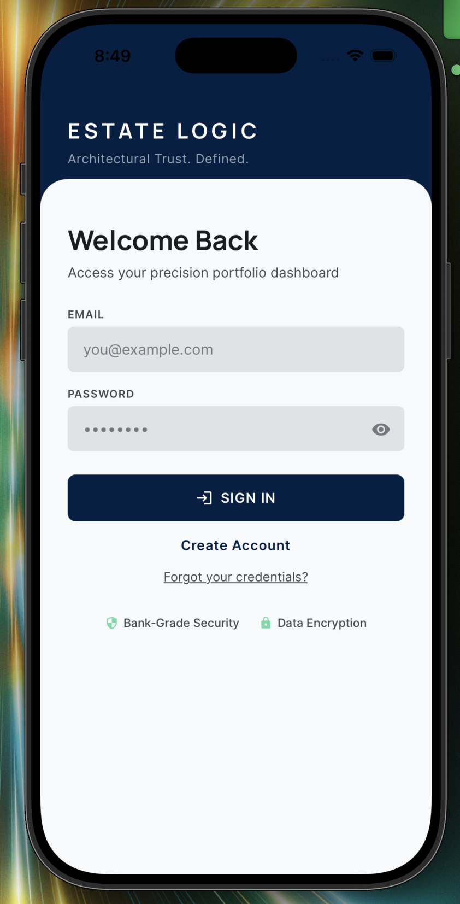
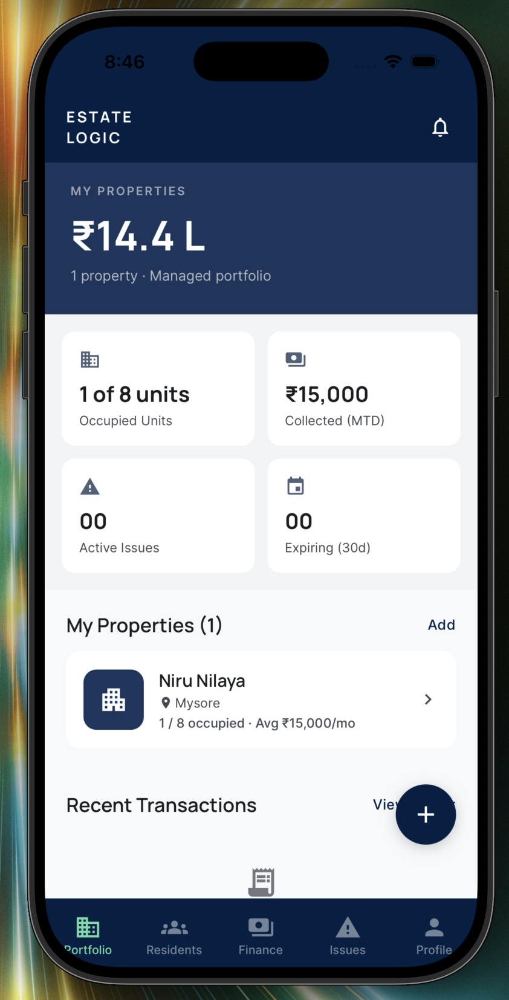
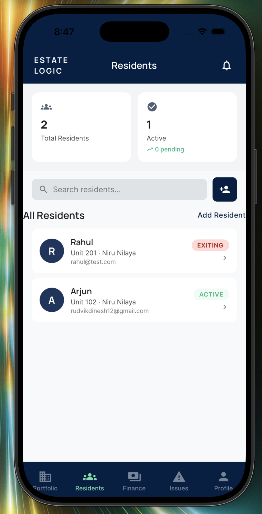
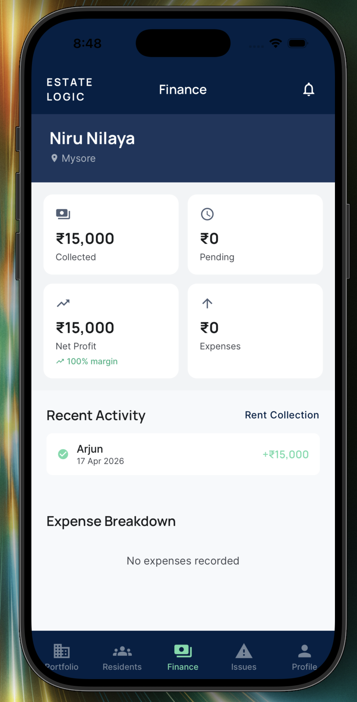
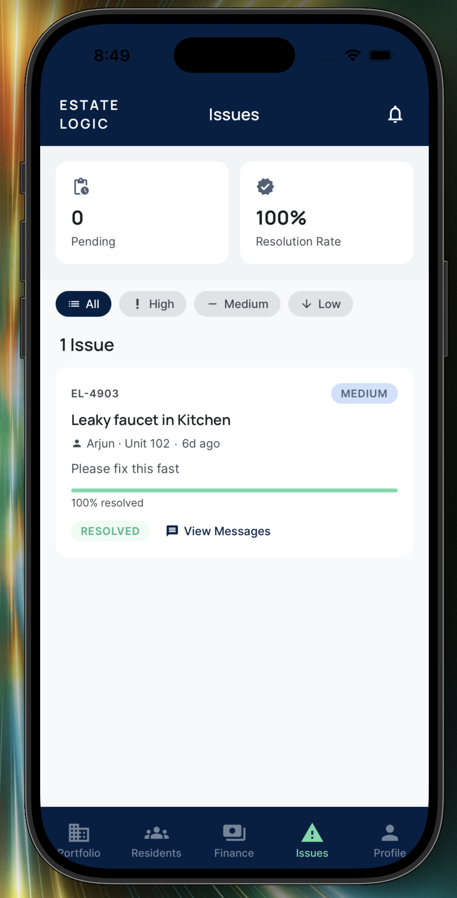
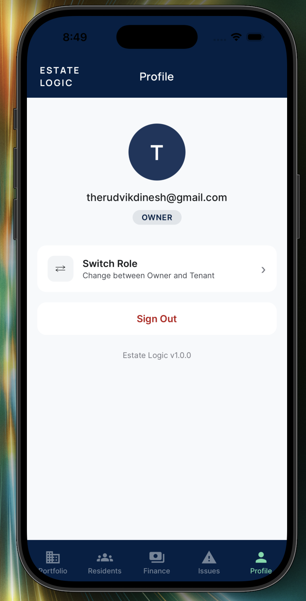
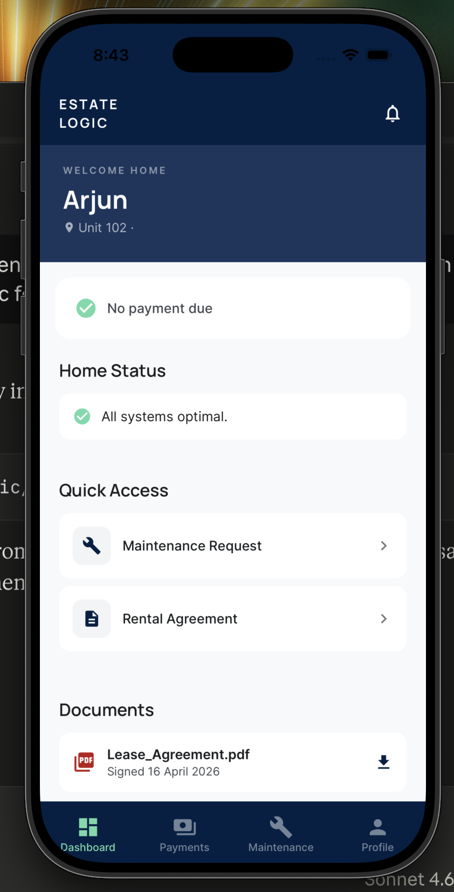
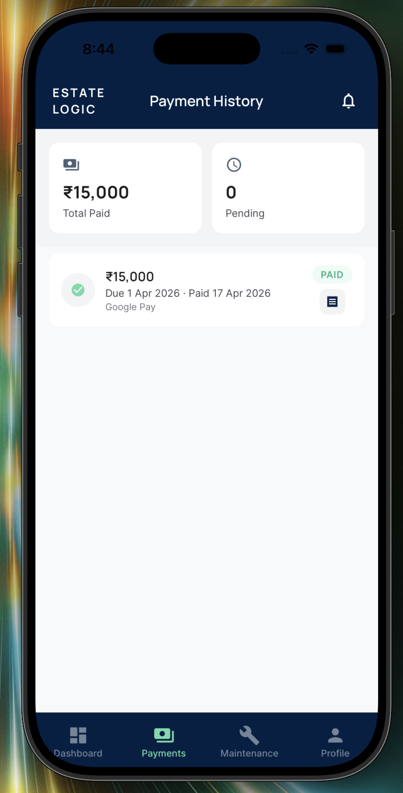
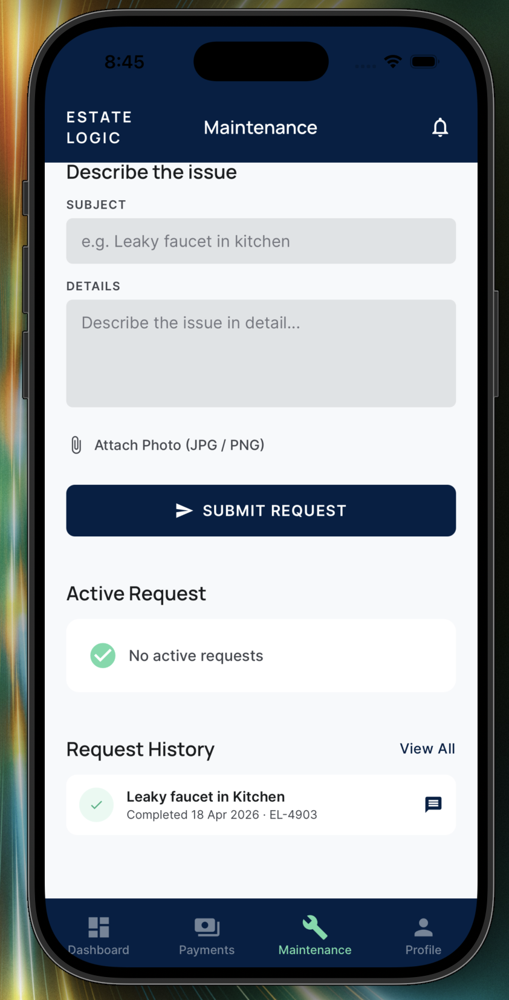
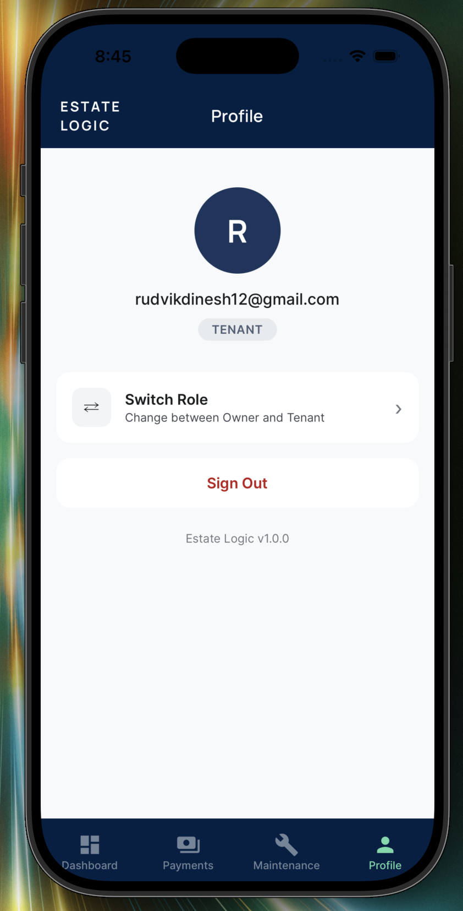

# EstateLogic

**Smart Property Management for Indian Landlords and Tenants**

---

## Overview

EstateLogic is a full-stack mobile application built with React Native and Expo that connects property owners and tenants on a single platform. Owners manage their entire portfolio — properties, tenants, finances, and maintenance — while tenants handle rent payments, maintenance requests, and lease documents, all from their phone.

The backend is powered by Supabase with PostgreSQL, row-level security policies enforced on every table, and real-time messaging via Supabase Realtime. The app targets the Indian rental market with INR currency formatting, UPI payment simulation, and Indian lease agreement templates.

---

## Features

### For Property Owners

- **Portfolio dashboard** — Property valuations, occupancy rates, month-to-date rent collected, active issues count, and expiring leases at a glance
- **Property management** — Add properties with type selection (apartment, house, villa, commercial) and automatic unit generation; edit details or delete with tenant guard
- **Tenant onboarding** — Four-step flow: personal information, unit assignment, lease creation, and confirmation
- **Resident directory** — Searchable list of all tenants across properties with status filtering and profile drill-down
- **Financial overview** — Rent collected vs. pending, expenses by category, net profit margin, and full transaction ledger
- **Rent collection screen** — Per-tenant payment status with overdue tracking
- **Maintenance issue tracking** — Priority-based issue queue with resolution progress, mark-as-resolved workflow, and resolution rate metrics
- **In-app messaging** — Real-time chat with tenants on individual maintenance issues
- **Tenant management** — Edit tenant details, update lease terms, deactivate tenants

### For Tenants

- **Home dashboard** — Rent due status, active maintenance tickets, quick-access shortcuts, and lease document links
- **UPI rent payment** — Pay via Google Pay, PhonePe, or Paytm (simulated); automatic pending payment creation based on active lease
- **Payment history** — Full payment ledger with downloadable PDF receipts via expo-print and expo-sharing
- **Maintenance requests** — Submit issues with subject, description, and photo attachment; track resolution progress on active requests
- **In-app messaging** — Real-time chat with property owner on maintenance issues
- **Rental agreement viewer** — View lease terms, digitally sign agreements, and download a full PDF copy
- **Lease documents** — Access and download the lease agreement PDF at any time from the dashboard

---

## Tech Stack

| Layer | Technology |
|---|---|
| Mobile framework | React Native + Expo SDK 54 |
| Backend | Supabase (PostgreSQL + Auth + Realtime) |
| Navigation | React Navigation v6 (stack + bottom tabs) |
| PDF generation | expo-print + expo-sharing |
| Push notifications | expo-notifications (local, scheduled) |
| UI/UX design | Google Stitch AI |
| Development | Claude Code (AI-assisted) |

---

## Architecture

**Database** — 8 tables (`users`, `properties`, `units`, `tenants`, `leases`, `payments`, `transactions`, `maintenance_requests`, `issue_messages`) with row-level security policies on every table. Owners access rows via `owner_id = auth.uid()`; tenants access their rows via the `user_id` foreign key chain.

**Navigation** — Role-based routing: `RootNavigator` gates on authentication state and user role, directing users to either `OwnerNavigator` (5-tab bottom navigation) or `TenantNavigator` (4-tab bottom navigation).

**Real-time messaging** — `IssueMessagesScreen` uses Supabase Realtime `postgres_changes` subscriptions per issue ID. Sender name and role are denormalized into each message row to avoid cross-user RLS read failures.

**PDF generation** — Lease agreements and payment receipts are generated client-side as HTML, printed to a local PDF file via `expo-print`, and shared via the native share sheet.

**Payment flow** — On the rent payment screen, the app checks for an existing pending payment row for the current month's due date before creating one, with a race-condition guard on the unique constraint.

**Data integrity** — Unique constraints on `(property_id, unit_number)` in the units table and `(tenant_id, due_date)` in the payments table prevent duplicate records.

---

## Screenshots

### Owner Side

<table>
  <tr>
    <td align="center"><br/>Login</td>
    <td align="center"><br/>Portfolio</td>
  </tr>
  <tr>
    <td align="center"><br/>Residents</td>
    <td align="center"><br/>Finance</td>
  </tr>
  <tr>
    <td align="center"><br/>Issues</td>
    <td align="center"><br/>Profile</td>
  </tr>
</table>

### Tenant Side

<table>
  <tr>
    <td align="center"><br/>Dashboard</td>
    <td align="center"><br/>Payments</td>
  </tr>
  <tr>
    <td align="center"><br/>Maintenance</td>
    <td align="center"><br/>Profile</td>
  </tr>
</table>

---

## Getting Started

### Prerequisites

- Node.js 18+
- Expo CLI (`npm install -g expo-cli`)
- Expo Go app on a physical device, or an iOS/Android simulator
- A Supabase project with the migrations in `supabase/migrations/` applied

### Installation

```bash
# Clone the repository
git clone https://github.com/Rudvik-17/EstateLogic.git
cd EstateLogic

# Install dependencies
npm install

# Configure environment
# Create a .env file at the project root:
EXPO_PUBLIC_SUPABASE_URL=https://your-project.supabase.co
EXPO_PUBLIC_SUPABASE_ANON_KEY=your-anon-key

# Start the development server
npx expo start
```

### Database Setup

Apply the migrations in order using the Supabase SQL editor:

```
supabase/migrations/001_create_tables.sql
supabase/migrations/002_seed_data.sql        # optional dev seed
supabase/migrations/003_fix_users_rls.sql
supabase/migrations/004_...
...
```

Before running the seed file, replace the placeholder UUIDs (`owner_uid`, `tenant1_uid`) with real user IDs from your Supabase Auth dashboard.

---

## Project Structure

```
src/
  context/AuthContext.js        # Auth state, role fetching, session management
  lib/
    supabase.js                 # Supabase client singleton
    notifications.js            # Local push notification helpers
    leaseAgreementHTML.js       # HTML template for lease agreement PDFs
    receiptHTML.js              # HTML template for payment receipt PDFs
  navigation/
    RootNavigator.js            # Auth gate and role-based routing
    OwnerNavigator.js           # Portfolio / Residents / Finance / Issues / Profile
    TenantNavigator.js          # Dashboard / Payments / Maintenance / Profile
  screens/
    auth/                       # LoginScreen, RoleSelectionScreen
    owner/                      # Dashboard, properties, residents, finance, issues
    tenant/                     # Dashboard, payments, maintenance, agreements
    shared/                     # ProfileScreen, IssueMessagesScreen
  components/                   # MetricCard, ScreenHeader, StatusChip, PrimaryButton
  theme/
    colors.js                   # Design token palette ("The Precision Atelier")
    typography.js               # Manrope (headlines) + Inter (body) font scale
    spacing.js                  # 4pt spacing scale
supabase/
  migrations/                   # Versioned SQL migration files
```

---

## Status

**v1.0** — Core features complete. Active development.

Completed: portfolio management, tenant onboarding, UPI payment simulation, maintenance workflow, real-time in-app messaging, PDF generation for receipts and lease agreements, local push notifications, pull-to-refresh on all list screens, full error and empty states.

---

## Author

**Rudvik Dinesh** — ECE Student | Building AI-Integrated Apps

---

*Built with React Native, Supabase, and Claude Code.*
